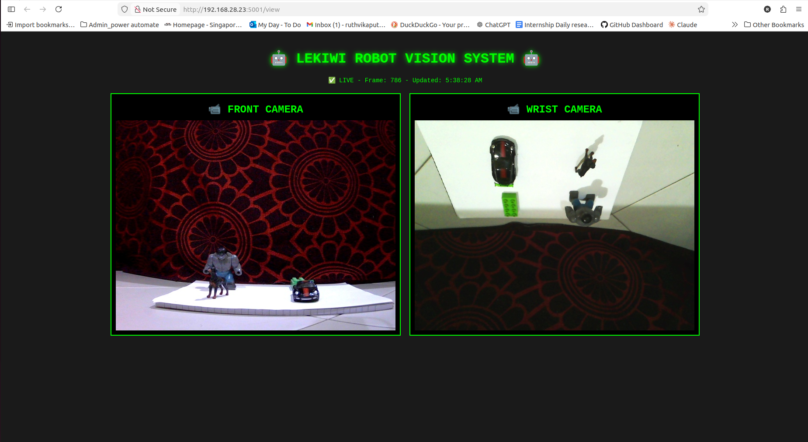
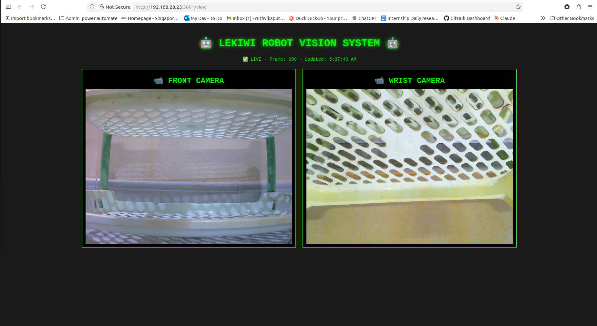
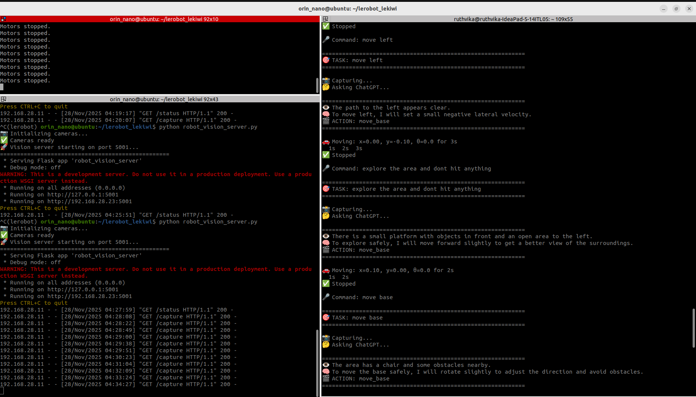
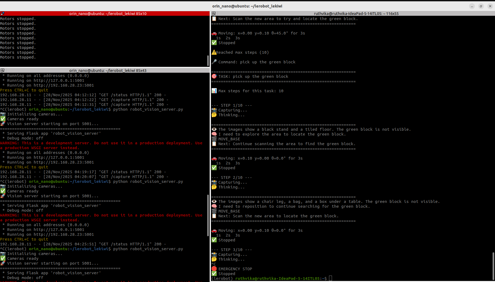
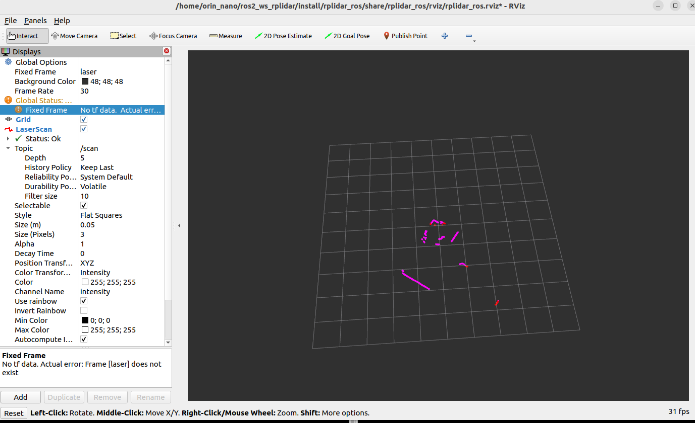
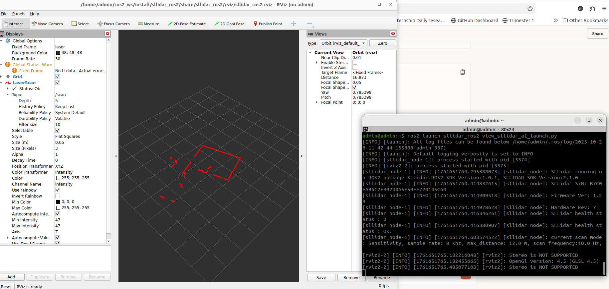

#  LeKiwi ChatGPT-Controlled Mobile Manipulator


## Table of Contents

1. [Introduction](#1-introduction)
2. [Gallery](#2-gallery)
3. [Objective](#3-objective)
4. [Requirements](#4-requirements)
5. [System Architecture](#5-system-architecture)
6. [Installation](#6-installation)
7. [Usage](#7-usage)
   - [Mode 1: Manual Teleoperation](#mode-1-manual-teleoperation)
   - [Mode 2: Vision-Only Autonomous](#mode-2-vision-only-autonomous)
   - [Mode 3: SLAM-Enabled Autonomous](#mode-3-slam-enabled-autonomous)
8. [Examples](#8-examples)
9. [Documentation](#9-documentation)
10. [Acknowledgments](#10-acknowledgments)

---

## 1. Introduction

This project implements an autonomous mobile manipulator using the LeKiwi platform controlled by ChatGPT-4o Vision API. The system integrates computer vision, natural language processing, and SLAM (Simultaneous Localization and Mapping) to enable intelligent robotic manipulation tasks.

The robot can operate in three modes:
- **Manual Teleoperation**: Direct human control via leader-follower arm
- **Vision-Only Autonomous**: ChatGPT controls robot using dual camera vision
- **SLAM-Enabled Autonomous**: Full autonomous navigation with mapping and localization


---

## 2. Gallery

### 2.1 Hardware Setup

<table>
  <tr>
    <td width="50%">
      
      <p align="center"><b>LeKiwi Robot with RPLidar A1</b></p>
    </td>
    <td width="50%">
      
      <p align="center"><b>Test Objects: Hulk, Green Block, Dog, Car</b></p>
    </td>
  </tr>
  <tr>
    <td width="50%">
      
      <p align="center"><b>Early Version with Raspberry Pi</b></p>
    </td>
    <td width="50%">
      
      <p align="center"><b>Test Environment: Point A (Robot), Point B (Objects), Point C (Shelf)</b></p>
    </td>
  </tr>
</table>

### 2.2 Calibration Positions


**Calibration Steps:** 1. Middle position → 2. Zero position → 3. Rotated position → 4. Rest position

### 2.3 Demo Videos

The robot autonomously finds and picks up 4 different objects using ChatGPT vision:

| Video | Task | Description |
|-------|------|-------------|
| **[1. Green Block](https://github.com/user-attachments/assets/4fbe7577-817d-48b2-8f71-75e29cb07fa9)** | Pick & Place | Robot locates and picks up green LEGO block |
| **[2. Dog Toy](https://github.com/user-attachments/assets/a52256bf-9474-4a11-8396-f66f9c767644)** | Pick & Place | Robot finds and grasps dog figurine |
| **[3. Toy Car](https://github.com/user-attachments/assets/590fbe7c-87a4-42a7-81ec-afdb6000e5e5)** | Pick & Place | Robot picks up miniature car |
| **[4. Hulk Figure](https://github.com/user-attachments/assets/f3a29932-a94b-4f20-b9a2-b4c9e271ad3e)** | Pick & Place | Robot grasps and moves Hulk action figure |
| **[5. Commands Demo](https://github.com/user-attachments/assets/6334025c-cc86-48e4-a7e8-6ca61f2f1f40)** | Full Session | Complete ChatGPT command and response recording |
| **[6. Early Demo](https://github.com/user-attachments/assets/ca721f20-3607-45c0-b459-f0a5a321b6a1)** | First Test | Initial successful test with Raspberry Pi |

### 2.4 System Screenshots

#### Camera Views

<table>
  <tr>
    <td width="50%">
      
      <p align="center"><b>Camera Server View: Objects at Point B</b></p>
    </td>
    <td width="50%">
      
      <p align="center"><b>Camera Server View: Shelf at Point C</b></p>
    </td>
  </tr>
</table>

#### ChatGPT Command Examples

<table>
  <tr>
    <td width="50%">
      
      <p align="center"><b>ChatGPT analyzing environment and planning actions</b></p>
    </td>
    <td width="50%">
      
      <p align="center"><b>Step-by-step execution with reasoning</b></p>
    </td>
  </tr>
</table>

#### SLAM Map Visualization

<table>
  <tr>
    <td width="50%">
      
      <p align="center"><b>RPLidar Scan - Building Map</b></p>
    </td>
    <td width="50%">
      
      <p align="center"><b>Real-time Laser Scan in RViz</b></p>
    </td>
  </tr>
</table>

---

## 3. Objective

The primary objectives of this project are:

1. **Integrate LLM with Robot Control**: Develop a system that uses ChatGPT-4o Vision API to control a mobile manipulator through natural language commands.

2. **Enable Vision-Based Manipulation**: Implement dual-camera system (front + wrist) for accurate object detection and manipulation.

3. **Achieve Autonomous Navigation**: Integrate SLAM using RPLidar A1 for mapping, localization, and position-aware navigation.

4. **Demonstrate Multi-Object Manipulation**: Successfully pick and place various objects with different shapes and sizes autonomously.

5. **Document Complete System**: Create comprehensive documentation for future development and knowledge transfer.

---

## 4. Requirements

### 4.1 Hardware Requirements

| Component | Model/Spec | Quantity | Purpose |
|-----------|------------|----------|---------|
| Main Computer | Jetson Orin Nano 8GB | 1 | Robot onboard controller |
| Development PC | Any (Ubuntu/macOS/Windows) | 1 | Control interface |
| Robot Platform | LeKiwi Mobile Manipulator | 1 | 6-DOF arm + 3-wheel base |
| Leader Arm | 6-DOF manipulator | 1 | Position reference (teleoperation) |
| Front Camera | USB webcam 640x480 | 1 | Forward vision |
| Wrist Camera | 8MP USB Camera | 1 | Gripper view |
| LiDAR Scanner | RPLidar A1 | 1 | 2D laser scanning (optional) |

### 4.2 Software Requirements

**On Jetson Orin Nano:**
- Ubuntu 24.04 (Jetson Linux)
- Python 3.10+
- Conda package manager
- LeRobot framework 
- ROS2 Humble (for SLAM mode only)
- Required libraries: `flask`, `opencv-python`, `numpy`

**On Development Laptop:**
- Ubuntu 20.04+ / macOS 11+ / Windows 10+ with WSL2
- Python 3.10+
- Conda package manager
- LeRobot framework
- Required libraries: `openai`, `requests`, `pillow`, `pyzmq`

**API Access:**
- OpenAI API key with GPT-4o Vision access
- Minimum $5 credit for API usage

### 4.3 Network Requirements

- Both Jetson and Laptop on same network
- Jetson static IP: `192.168.28.23` (recommended)
- Open ports: 5555 (ZMQ), 5001 (HTTP), 5002 (HTTP)

---

## 5. System Architecture

### 5.1 High-Level Architecture
```
┌─────────────────────────────────────────────────────────────┐
│                      USER / OPERATOR                        │
│                 (Laptop or Remote Access)                   │
└────────────────────────┬────────────────────────────────────┘
                         │
                         ↓
    ┌────────────────────────────────────────────────┐
    │      AI Brain (ChatGPT-4o Vision API)          │
    │      • Analyzes camera images                  │
    │      • Makes decisions                         │
    │      • Plans actions                           │
    └────────────────────┬───────────────────────────┘
                         │
                         ↓
    ┌────────────────────────────────────────────────┐
    │  Jetson Orin Nano (Robot Computer)             │
    │  • Motor control (port 5555)                   │
    │  • Camera capture (port 5001)                  │
    │  • SLAM mapping (port 5002)                    │
    │  • Sensor processing                           │
    └────────────────────┬───────────────────────────┘
                         │
                         ↓
    ┌────────────────────────────────────────────────┐
    │      Physical Robot (LeKiwi)                   │
    │      • 6-DOF arm + gripper                     │
    │      • 3-wheel omnidirectional base            │
    │      • 2 cameras (front + wrist)               │
    │      • RPLidar A1 (360° laser scanner)         │
    └────────────────────────────────────────────────┘
```

### 5.2 Software Components

**Five Main Scripts:**

1. **control_robot.py** (Jetson)
   - Motor control server
   - Port: 5555 (ZMQ)
   - Always running

2. **robot_vision_server.py** (Jetson)
   - Camera image server
   - Port: 5001 (HTTP)
   - Always running

3. **slam_map_server.py** (Jetson)
   - SLAM data server
   - Port: 5002 (HTTP)
   - SLAM mode only

4. **chatgpt_lekiwi_final.py** (Laptop)
   - Vision-only autonomous controller
   - Connects to ChatGPT API

5. **chatgpt_lekiwi_slam.py** (Laptop)
   - SLAM-enabled autonomous controller
   - Connects to ChatGPT API

### 5.3 Communication Protocol

| Port | Protocol | Service | Direction |
|------|----------|---------|-----------|
| 5555 | ZMQ PUB-SUB | Robot motor commands | Laptop → Jetson |
| 5001 | HTTP REST | Camera images | Jetson → Laptop |
| 5002 | HTTP REST | SLAM data | Jetson → Laptop |

### 5.4 Data Flow
```
User Command ("pick up green block")
    ↓
Laptop: chatgpt_lekiwi_final.py
    ↓ HTTP GET
Jetson: robot_vision_server.py → Returns camera images
    ↓ HTTPS POST
OpenAI API: ChatGPT-4o Vision
    - Analyzes images
    - Plans next action
    ↓ JSON Response
Laptop: Executes action
    ↓ ZMQ Message
Jetson: control_robot.py → Moves motors
    ↓
Physical Robot: Executes movement
```

---

## 6. Installation

### 6.1 Clone Repository
```bash
git clone https://github.com/alfredang/lerobot.git
cd lerobot
```

### 6.2 Install on Jetson Orin Nano
```bash
# SSH into Jetson
ssh orin_nano@192.168.28.23
# Password: jetson192024

# Install LeRobot framework
git clone https://github.com/huggingface/lerobot.git
cd lerobot
conda create -n lerobot python=3.10
conda activate lerobot
pip install -e .

# Install additional packages
pip install flask opencv-python numpy

# Install ROS2 Humble (for SLAM mode)
sudo apt install ros-humble-desktop
sudo apt install ros-humble-rplidar-ros ros-humble-slam-toolbox

# Set permissions
sudo chmod 666 /dev/video0 /dev/video2 /dev/ttyUSB0 /dev/ttyACM0
```

### 6.3 Install on Laptop
```bash
# Install LeRobot framework
git clone https://github.com/huggingface/lerobot.git
cd lerobot
conda create -n lerobot python=3.10
conda activate lerobot
pip install -e .

# Install additional packages
pip install openai requests pillow pyzmq flask

# Set permissions
sudo chmod 666 /dev/ttyACM0
```

### 6.4 Configure OpenAI API
```bash
# Get API key from: https://platform.openai.com/api-keys
# Add billing: https://platform.openai.com/settings/organization/billing

# Set permanently
echo 'export OPENAI_API_KEY="sk-proj-YOUR_KEY_HERE"' >> ~/.bashrc
source ~/.bashrc

# Verify
echo $OPENAI_API_KEY
```

### 6.5 Set Up Calibration Files

**On Laptop:**
```bash
mkdir -p ~/.cache/calibration/lekiwi
cp calibration/lekiwi/main_leader.json ~/.cache/calibration/lekiwi/
```

**On Jetson:**
```bash
# Should already exist at:
ls ~/lerobot_lekiwi/.cache/calibration/lekiwi/main_follower.json
```

For detailed installation instructions, see [Installation Guide](docs/INSTALLATION.md).

---

## 7. Usage

### Mode 1: Manual Teleoperation

**Purpose:** Direct human control for testing, calibration, and data collection.

**Startup Procedure:**

**Step 1: Start Robot Control Server (Jetson Terminal 1)**
```bash
ssh orin_nano@192.168.28.23
# Password: jetson192024
cd ~/lerobot_lekiwi && conda activate lerobot

# Set permissions
sudo chmod 666 /dev/video0 /dev/video2 /dev/ttyACM0

# Start server
python lerobot/scripts/control_robot.py \
  --robot.type=lekiwi \
  --robot.cameras='{}' \
  --control.type=remote_robot
```

**Expected Output:**
```
[INFO] Loaded calibration from .cache/calibration/lekiwi/main_follower.json
[INFO] Applied calibration for follower arm.
Motors set to velocity mode.
LeKiwi robot server started. Waiting for commands...
```

**Step 2: Start Teleoperation Controller (Laptop Terminal)**
```bash
cd ~ && conda activate lerobot

# Set permissions
sudo chmod 666 /dev/ttyACM0

# Start teleoperation
python run_lekiwi_teleop.py
```

**Expected Output:**
```
🎮 LeKiwi Manual Teleoperation
================================
✅ Connected to leader arm
✅ Connected to robot at 192.168.28.23:5555
Running at 30Hz. Press Ctrl+C to stop.
```

**Operation:**
- Move leader arm → Follower arm mirrors movements
- Press `Ctrl+C` to stop

---

### Mode 2: Vision-Only Autonomous

**Purpose:** AI-controlled robot using camera vision for autonomous manipulation.

**Startup Procedure:**

**Step 1: Start Robot Control Server (Jetson Terminal 1)**
```bash
ssh orin_nano@192.168.28.23
cd ~/lerobot_lekiwi && conda activate lerobot
sudo chmod 666 /dev/video0 /dev/video2 /dev/ttyACM0

python lerobot/scripts/control_robot.py \
  --robot.type=lekiwi \
  --robot.cameras='{}' \
  --control.type=remote_robot
```

**Step 2: Start Vision Server (Jetson Terminal 2 - new SSH window)**
```bash
ssh orin_nano@192.168.28.23
cd ~/lerobot_lekiwi && conda activate lerobot

python robot_vision_server.py
```

**Expected Output:**
```
📷 Initializing cameras...
✅ Cameras ready
🚀 Vision server starting on port 5001...
 * Running on http://192.168.28.23:5001
```

**Step 3: Start ChatGPT Controller (Laptop Terminal)**
```bash
cd ~ && conda activate lerobot
sudo chmod 666 /dev/ttyACM0

# Set API key
export OPENAI_API_KEY="sk-proj-YOUR_KEY_HERE"

# Run controller
python chatgpt_lekiwi_final.py
```

**Expected Output:**
```
🧠 ChatGPT FULL AUTONOMOUS Controller
============================================================
📊 Baseline arm positions: [2048, 2200, 1800, ...]
✅ Connected
📹 Camera view: http://192.168.28.23:5001/view
============================================================

🎮 FULL AUTONOMOUS MODE
Commands:
  - 'explore the area'
  - 'pick up the green block'
  - 'move arm up'
  - 'quit'

🎤 Command: _
```

**Step 4: View Cameras (Optional)**

Open browser: `http://192.168.28.23:5001/view`

**Test Commands:**
```
🎤 Command: explore the area
🎤 Command: pick up the green block
🎤 Command: pick up the dog and place it on the shelf
🎤 Command: find the toy car
🎤 Command: move forward slowly
🎤 Command: quit
```

---

### Mode 3: SLAM-Enabled Autonomous

**Purpose:** Full autonomous navigation with mapping, localization, and position awareness.

**Startup Procedure:**

**Step 1: Start Robot Control Server (Jetson Terminal 1)**
```bash
ssh orin_nano@192.168.28.23
cd ~/lerobot_lekiwi && conda activate lerobot
sudo chmod 666 /dev/video0 /dev/video2 /dev/ttyUSB0 /dev/ttyACM0

python lerobot/scripts/control_robot.py \
  --robot.type=lekiwi \
  --robot.cameras='{}' \
  --control.type=remote_robot
```

**Step 2: Start Vision Server (Jetson Terminal 2)**
```bash
ssh orin_nano@192.168.28.23
cd ~/lerobot_lekiwi && conda activate lerobot

python robot_vision_server.py
```

**Step 3: Start SLAM System (Jetson Terminal 3)**
```bash
ssh orin_nano@192.168.28.23

# Source ROS2
source /opt/ros/humble/setup.bash
cd ~/ros2_ws_rplidar
source install/setup.bash

# Launch RPLidar node
ros2 launch rplidar_ros rplidar_a1_launch.py &

# Wait for LiDAR to initialize
sleep 3

# Launch SLAM Toolbox
ros2 launch slam_toolbox online_async_launch.py
```

**Expected Output:**
```
[rplidar_node]: RPLidar health status OK
[rplidar_node]: Publishing laser scans at 5.5 Hz
[slam_toolbox]: Starting mapper...
[slam_toolbox]: Mapper started. Waiting for scans...
```

**Step 4: Start SLAM Data Server (Jetson Terminal 4)**
```bash
ssh orin_nano@192.168.28.23
cd ~/lerobot_lekiwi && conda activate lerobot

python slam_map_server.py
```

**Expected Output:**
```
============================================================
🗺️  SLAM Map Server Starting...
============================================================

Endpoints:
  GET  /slam_data     - Get map + pose + objects
  POST /save_object   - Save object location
  GET  /objects       - List known objects
  GET  /status        - Health check

Starting on http://0.0.0.0:5002
============================================================

[slam_data_server]: SLAM Data Server ready!
```

**Step 5: Start ChatGPT SLAM Controller (Laptop Terminal)**
```bash
cd ~ && conda activate lerobot
sudo chmod 666 /dev/ttyACM0

# Set API key
export OPENAI_API_KEY="sk-proj-YOUR_KEY_HERE"

# Run SLAM-enabled controller
python chatgpt_lekiwi_slam.py
```

**Expected Output:**
```
🧠 ChatGPT Lekiwi with SLAM
============================================================
📡 Testing SLAM server...
✅ SLAM server connected
✅ Robot connected
📹 Cameras: http://192.168.28.23:5001/view
============================================================

🎮 SLAM-ENABLED INTERACTIVE MODE
============================================================

Commands:
  • 'explore the area and build a map'
  • 'find the green block'
  • 'pick up the green block and place it on the shelf'
  • 'return to home position'
  • 'quit'

📹 Cameras: http://192.168.28.23:5001/view
============================================================

🎤 Command: _
```

**Advanced Test Commands:**
```
🎤 Command: explore the area and build a map

🎤 Command: find the green block

🎤 Command: pick up the green block and place it on the top shelf

🎤 Command: pick up the dog, place it on the shelf, then return home

🎤 Command: return to home position

🎤 Command: quit
```

**What SLAM Adds:**
- ✅ Exact position tracking (x, y, θ in meters/degrees)
- ✅ 2D occupancy grid map
- ✅ Object location memory
- ✅ Distance estimation from map
- ✅ Ability to return to saved positions
- ✅ Path planning around obstacles

---

## 8. Examples

### Example 1: Simple Pick and Place

**User Command:**
```
🎤 Command: pick up the green block
```

**System Execution:**
```
Step 1/10: Capturing images...
Step 1/10: Thinking...

🔍 Observation: Green LEGO block visible in front camera
📋 Reasoning: Block appears 40cm ahead, need to approach
🎬 Action: move_base(x=0.15, y=0, theta=0, duration=3)
✅ Stopped

Step 2/10: Capturing images...
Step 2/10: Thinking...

🔍 Observation: Block now very close, centered in view
📋 Reasoning: Ready to grasp, lower arm to ground level
🎬 Action: move_arm("lower_to_ground", duration=2.5)
✅ Arm moved

Step 3/10: Capturing images...
Step 3/10: Thinking...

🔍 Observation: Gripper positioned above block
📋 Reasoning: Close gripper to grasp block
🎬 Action: gripper(close=true)
✅ Gripper done

...

Step 7/10: Capturing images...
Step 7/10: Thinking...

🔍 Observation: Block firmly grasped in gripper
📋 Reasoning: Task complete, block picked up
🎬 Action: done

⏱️ Reached max steps (10)
✅ Task complete!
```

### Example 2: Multi-Step Task with SLAM

**User Command:**
```
🎤 Command: pick up the green block and place it on the shelf
```

**System Execution (SLAM-Enabled):**
```
Step 1/25: Capturing images...
         Capturing SLAM data...
Step 1/25: Thinking...

🔍 Observation: Green block visible in front camera at Point B
             Map shows I'm at position (0.5, 0.3, 0°)
             Shelf location not yet known
📋 Reasoning: Need to locate and save block position first
🎬 Action: save_object_location("green_block")
✅ Saved 'green_block' at (0.7, 0.3)

Step 2/25: Capturing images...
         Capturing SLAM data...
Step 2/25: Thinking...

🔍 Observation: Block is 0.2m away based on map
             Path is clear according to occupancy grid
📋 Reasoning: Approach block with small forward movement
🎬 Action: move_base(x=0.10, y=0, theta=0, duration=2)
✅ Stopped

...

Step 12/25: Capturing images...
          Capturing SLAM data...
Step 12/25: Thinking...

🔍 Observation: Holding green block, shelf visible in camera
              Map shows shelf location different from current position
📋 Reasoning: Save shelf location for navigation
🎬 Action: save_object_location("shelf")
✅ Saved 'shelf' at (2.5, 1.8)

...

Step 20/25: Capturing images...
          Capturing SLAM data...
Step 20/25: Thinking...

🔍 Observation: At shelf location (2.5, 1.8)
              Arm raised, gripper holding block
📋 Reasoning: Release block onto shelf
🎬 Action: gripper(close=false)
✅ Gripper done

Step 21/25: Capturing images...
          Capturing SLAM data...
Step 21/25: Thinking...

🔍 Observation: Block placed on shelf, task complete
📋 Reasoning: Mission accomplished
🎬 Action: done

⏱️ Reached max steps (25)
✅ Task complete!
```

### Example 3: Exploration with Mapping

**User Command:**
```
🎤 Command: explore the area and build a map
```

**System Behavior:**
- Robot moves in pattern to scan environment
- SLAM builds 2D occupancy grid map
- Identifies free space and obstacles
- Returns position data each step
- Map available at: `http://192.168.28.23:5002/slam_data`

---

## 9. Documentation

### 9.1 Quick Reference

- **[Quick Commands](quick_reference/COMMANDS.md)** - All commands copy-paste ready
- **[Installation Guide](docs/INSTALLATION.md)** - Complete setup instructions
- **[Troubleshooting](docs/TROUBLESHOOTING.md)** - Common issues and solutions


### 9.2 Key Configuration Files

**Calibration Files:**
- Leader arm: `~/.cache/calibration/lekiwi/main_leader.json`
- Follower arm: `~/lerobot_lekiwi/.cache/calibration/lekiwi/main_follower.json`

**Connection Details:**
- Jetson IP: `192.168.28.23`
- Password: `jetson192024`
- ZMQ Port: `5555`
- HTTP Ports: `5001`, `5002`

---

## 10. Acknowledgments

This project was made possible by:

- **Hugging Face LeRobot Team** - For the excellent LeRobot framework
- **OpenAI** - For GPT-4o Vision API
- **ROS2 Community** - For SLAM Toolbox and navigation stack
- **Seeed Studio** - For LeKiwi mobile manipulator platform
- **SLAMTEC** - For RPLidar A1 sensor

### Related Projects

- [LeRobot Framework](https://github.com/huggingface/lerobot) - Robot learning framework
- [SLAM Toolbox](https://github.com/SteveMacenski/slam_toolbox) - ROS2 SLAM implementation
- [RPLidar ROS2](https://github.com/ros-drivers/rplidar_ros) - LiDAR driver

### References

- OpenAI API Documentation: https://platform.openai.com/docs
- ROS2 Humble Documentation: https://docs.ros.org/en/humble/
- LeRobot Documentation: https://github.com/huggingface/lerobot

---

